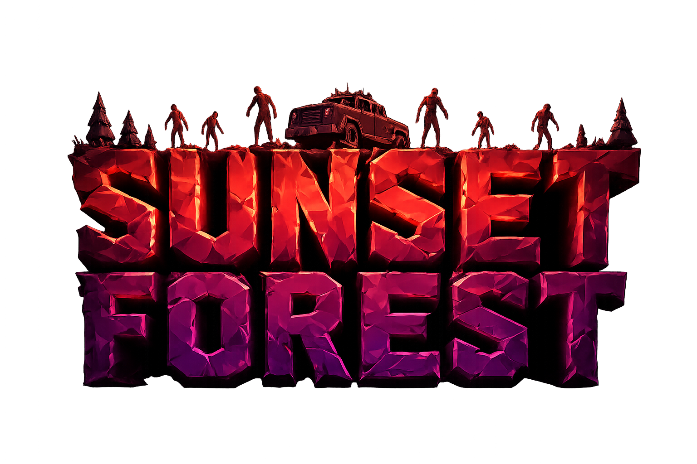
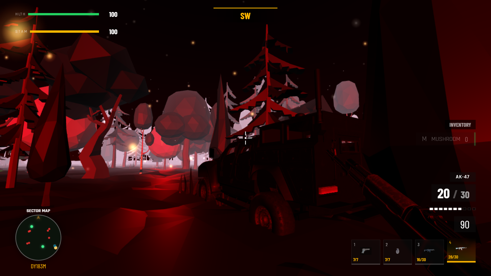

# Sunset Forest: Survival Edition

<p align="center">
  
</p>

**Use it now:** [Play the game](https://MEDELBOU3.github.io/Sunset-Forest/game-project/)

## Overview

**Sunset Forest: Survival Edition** is an immersive 3D survival game built with **JavaScript** and **Three.js**. Experience a stylized, atmospheric world where beauty meets danger. Navigate through a dense forest at sunset, scavenge for supplies, and fight to survive against waves of relentless zombies.

## Key Features

- **Dynamic Combat**: Engaging gunplay with various weapons (pistols, rifles, snipers), headshot detection, hit markers, and grenade mechanics.
- **Loot & Survival**: Scavenge the world for ammo, healing mushrooms, and weapon upgrades like scopes.
- **Exploration**: A beautifully stylized low-poly environment with dynamic lighting, fog, and ambient audio.
- **Vehicles & Companions**: Drive armored vehicles for mobility and combat, and fight alongside a friendly companion who helps you survive.
- **Progression System**: Face increasing challenges through wave-based stage progression and evolving enemy difficulty.
- **Multiplayer Ready**: Integrated with Firebase for authentication and real-time multiplayer capabilities.

## Technical Highlights

- **Custom 3D Engine**: Built on top of Three.js with modular JavaScript components for easy maintenance and scaling.
- **Optimized Performance**: Features runtime performance tweaks, asset management, and efficient collision handling.
- **Rich UI/UX**: Includes a custom HUD, weapon wheel, minimap, and interactive menus.
- **Real-time Backend**: Powered by Node.js, Express, and Firebase for user auth and multiplayer synchronization.

## Getting Started

### Prerequisites
- [Node.js](https://nodejs.org/) installed on your machine.

### Installation
1. Clone the repository:
   ```bash
   git clone https://github.com/MEDELBOU3/Sunset-Forest.git
   ```
2. Navigate to the project directory:
   ```bash
   cd Sunset-Forest
   ```
3. Install dependencies:
   ```bash
   npm install
   ```

### Running the Project
To start the server and play the game:
```bash
npm run server
```
Then open your browser and navigate to `http://localhost:3000` (or the port specified in your console).

---

Developed by [MOHAMED EL-BOUANANI](https://github.com/MEDELBOU3)

